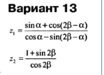

# Лабораторная работа 2. Расчёт значения функции в заданной точке.

Разработайте программу, рассчитывающую значения двух указанных функций. Входные значения аргументов запросите с консоли. Полученные значения функций выведите на консоль.

