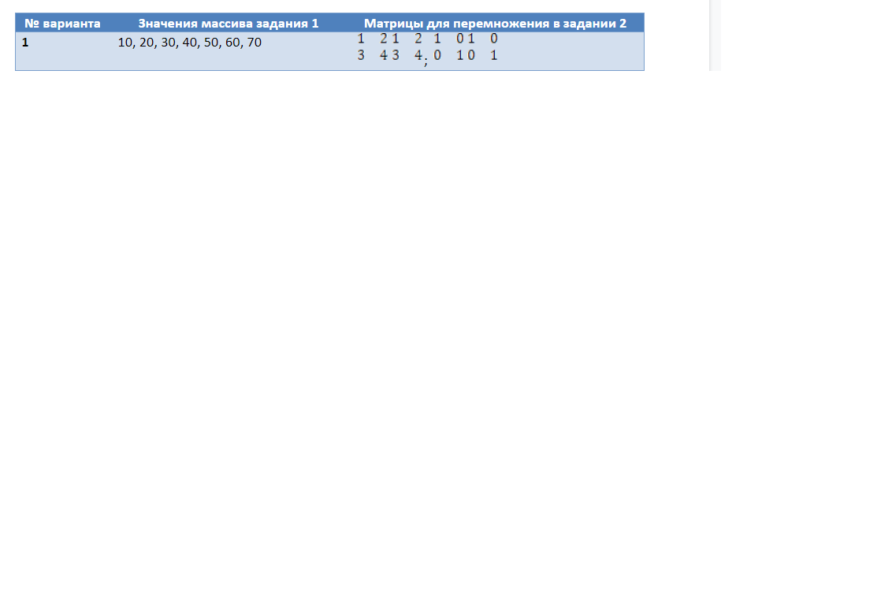

# Лабораторная работа 5. Массивы

Задания:

Заполнить массив значениями согласно варианту. Результат в виде таблицы значений массива вывести на консоль.

Реализовать перемножение двух матриц 2х2 на основании данных варианта задания. Результат в виде таблицы значений элементов результирующей матрицы вывести на консоль.

Варианты заданий

